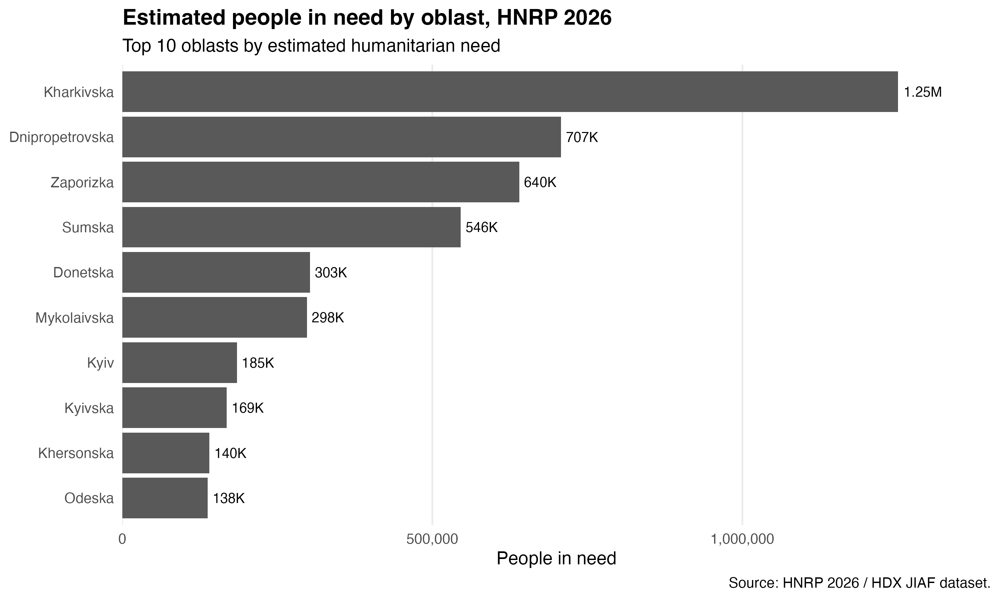
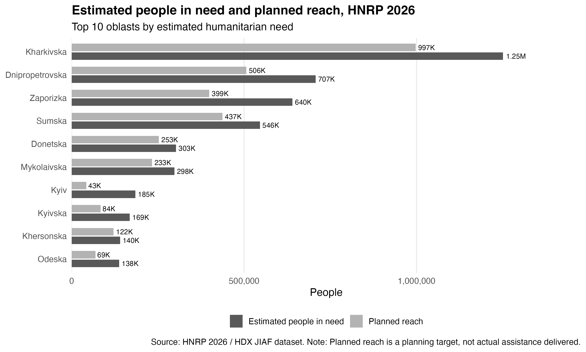
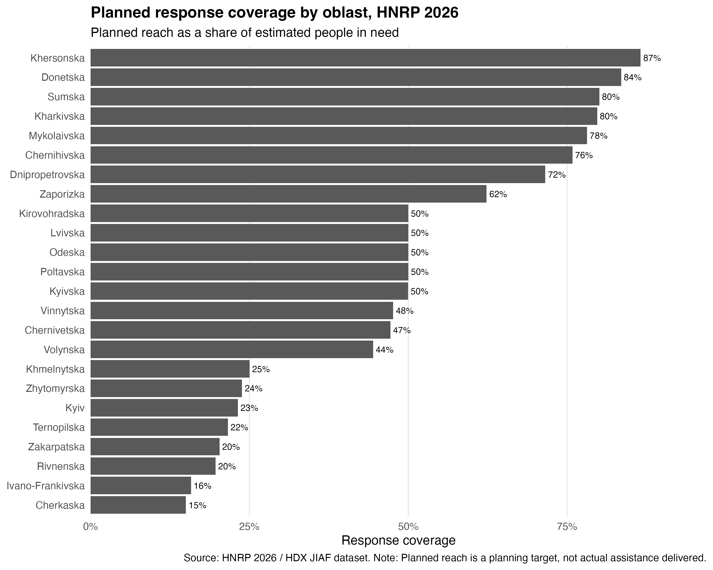
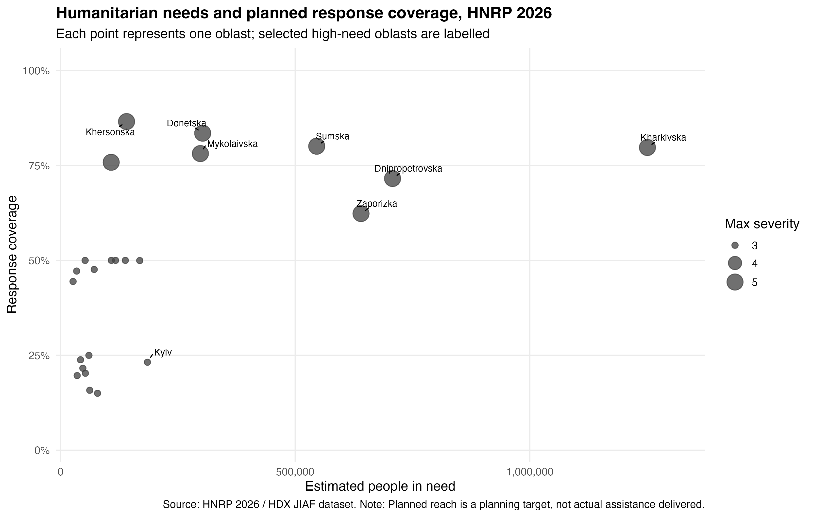

# Humanitarian Needs Analysis in Ukraine (HNRP 2026)

A reproducible R-based analytical project exploring humanitarian needs, planned response coverage, and severity across Ukrainian oblasts using the 2026 Humanitarian Needs and Response Plan (HNRP) dataset.

The project demonstrates a complete analytical workflow, from importing raw humanitarian planning data to cleaning, aggregation, exploratory analysis, visualisation, and interpretation. It was developed as a portfolio project to demonstrate practical skills in humanitarian data analysis, monitoring, reporting, and reproducible research using R.

---

# Project Overview

Humanitarian organisations rely on data to prioritise assistance where needs are greatest. This project analyses publicly available HNRP 2026 planning data to explore regional patterns in humanitarian needs across Ukraine.

The workflow includes:

- importing raw humanitarian datasets;
- cleaning and validating data;
- standardising variables;
- aggregating indicators at oblast (ADM1) level;
- calculating exploratory humanitarian indicators;
- producing publication-ready visualisations;
- summarising findings in a short analytical policy brief.

The entire analysis is fully reproducible and can be recreated by running the provided R scripts.

---

# Research Question

**Which Ukrainian oblasts have the highest estimated humanitarian needs, and how does planned humanitarian response coverage vary across regions and humanitarian severity levels?**

---

# Dataset

Source:

- Ukraine Humanitarian Needs and Response Plan (HNRP) 2026
- Joint Intersectoral Analysis Framework (JIAF)
- Humanitarian Data Exchange (HDX)

The analysis focuses on oblast-level (ADM1) indicators extracted from:

- Overall Humanitarian Needs
- Internally Displaced Persons (IDPs)
- War-Affected Non-Displaced Population

---

# Tools

- R
- tidyverse
- ggplot2
- dplyr
- tidyr
- readxl
- readr
- forcats
- ggrepel
- scales

---

# Analytical Workflow

```
Raw HNRP Excel workbook
        │
        ▼
Import selected worksheets
        │
        ▼
Data cleaning & validation
        │
        ▼
Variable standardisation
        │
        ▼
Oblast-level aggregation
        │
        ▼
Exploratory data analysis
        │
        ▼
Data visualisation
        │
        ▼
Analytical policy brief
```

---

# Repository Structure

```
.
├── R/                 # Analysis scripts
├── data/
│   ├── raw/           # Original HNRP workbook
│   └── processed/     # Clean analytical datasets
├── outputs/
│   ├── charts/        # Visualisations
│   └── tables/        # Summary tables
└── report/            # Analytical policy brief
```

---

# Project Outputs

The project automatically generates:

- cleaned analytical datasets;
- oblast-level summary tables;
- exploratory humanitarian indicators;
- publication-ready visualisations;
- analytical policy brief.

---

# Key Findings

The exploratory analysis identifies several important patterns:

- Humanitarian needs are concentrated in eastern, southern, and frontline-affected oblasts.
- Kharkivska oblast records the highest estimated humanitarian need.
- Planned response coverage generally increases in oblasts with the highest humanitarian severity.
- Coverage varies substantially between oblasts and should be interpreted as planning targets rather than actual assistance delivered.
- Estimated humanitarian need and severity describe different dimensions of the humanitarian situation and should be analysed together.

---

# Visualisations

## Estimated People in Need



---

## Planned Reach vs Estimated Need



---

## Planned Response Coverage



---

## Humanitarian Needs vs Response Coverage



---

# Policy Brief

A short analytical report describing the methodology, findings, monitoring implications, and limitations is available in:

**report/short_policy_brief.md**

---

# Reproducing the Analysis

Run the scripts in the following order:

```r
source("R/01_data_import.R")
source("R/02_data_cleaning.R")
source("R/03_exploratory_analysis.R")
source("R/04_visualisation.R")
```

Each script builds on the outputs generated by the previous step.

---

# Limitations

This project represents an exploratory analysis of humanitarian planning data.

Key methodological considerations include:

- planned reach represents planning targets rather than actual assistance delivered;
- aggregated indicators may include overlap across strategic-priority groups;
- severity reflects the maximum recorded severity within an oblast;
- oblast-level aggregation simplifies local humanitarian variation.

These limitations are discussed in greater detail in the accompanying policy brief.

---

# Future Development

Future iterations of the project may include:

- validation of the aggregation methodology against HNRP documentation;
- integration of additional humanitarian datasets (e.g. IOM DTM);
- comparison of planned reach with operational response data;
- development of an interactive dashboard.

---

# Author

**Kostiantyn Serikov**

This repository was developed as part of my transition into humanitarian data analysis and monitoring. It demonstrates my ability to build reproducible analytical workflows in R, communicate findings through data visualisation, and translate humanitarian planning data into structured analytical outputs.
